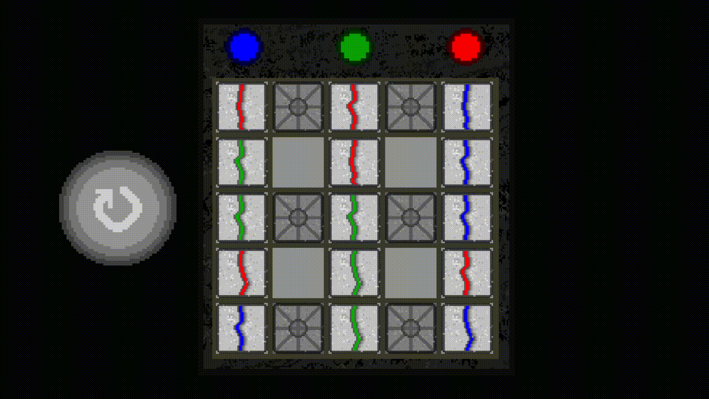

# О проекте

Nightmare Realm - это тестовое задание, написанное на движке GameMaker Studio 2.



> В архиве присутвуют две директории: `Build`, в которой находится игра и `Project` с проектом. Для запуска проекта нужно открыть файл проекта `Nightmare Realm.yyp`. Если нет среды GamMaker Studio 2, то код можно посмотреть далее или самостоятельно в файлах с расширением `.gml`.

В проекте присутствуют директории:
- objects (директория с классами)
- rooms (директория, в которой хранятся 2д сцены)
- scripts (вспомогательные функции, вынесенные в отдельный файл)
- sprites (спрайты)

[TOC]

# Глобальные переменные

В проекте определены глобальные переменные в скрипте `global_vars.gml`:

```gml
function global_vars(){
	globalvar scale_factor;		// Параметр масштабирования спрайтов
	scale_factor = 1;
	globalvar cell_width;		// Ширина свободного пространства в клетке (SpriteField)
	cell_width = 11;
	globalvar mouse_select_chip;// Флаг "выбрана ли фишка?"
	mouse_select_chip = false;
	globalvar cell_map;		// Карта поля размером 5х5
	globalvar cell_ind;		// Массив индексов для выигрышной позиции
	globalvar cell_correct; // Массив для проверки собранных столбцов
		cell_correct = [0, 0, 0];
}
```

# Классы

## Chip

Данный класс описывает передвигаемую фишку. В классе определены 5 методов.

Метод при создании (`Create_0.gml`) определяет параметры.

```gml
resize_param = 0;       // Параметр масштабирования при выборе фишки
resize_bool = false;    // Флаг увеличения фишки
blink_param = 0.0;      // Параметр "мигания" текущей клетки

image_index = irandom_range(0, 2); // Задать случайное изображение фишки
image_speed = 0; // Отключение анимации

index_x = 0; // Индекс на карте [0, 5] по оси ОХ
index_y = 0; // Индекс на карте [0, 5] по оси ОУ

shift_pos_x = 0; // Смещение фишки
shift_pos_y = 0;

calc_width = (cell_width+1)*scale_factor; // Ширина и высота фишки
pos_x = 0; // Новая позиция, относительно курсора
pos_y = 0;
```

Метод отрисовки `Draw_0.gml`:

```gml
/// @description
draw_set_alpha(abs(blink_param)*0.5);	// Задать прозрачность
draw_set_color(c_navy);					// Задать цвет
// Текущая позиция
draw_rectangle(x - resize_param + 5, 
				y - resize_param + 5, 
				x + chip_width + resize_param - 5, 
				y + chip_width + resize_param - 5,
				false);
// Выбор цвета для фишки
switch(color_index){
	default:
	case 0:
		draw_set_color(c_red);
		break;
	case 1:
		draw_set_color(c_green);
		break;
	case 2:
		draw_set_color(c_blue);
		break;
}
draw_set_alpha(1);
// Цвет у текстуры провода
draw_rectangle(x - resize_param + shift_pos_x + 3, 
				y - resize_param + shift_pos_y, 
				x + chip_width + resize_param + shift_pos_x - 3, 
				y + chip_width + resize_param + shift_pos_y,
				false);

// Спрайт фишки
draw_sprite_stretched(SpriteChipImg, image_index, x - resize_param + shift_pos_x, 
				y - resize_param + shift_pos_y, 
				chip_width + resize_param*2 + 1, 
				chip_width + resize_param*2 + 1);


draw_set_alpha(1);
draw_set_color(c_white);
```

Метод обновления `Step_0.gml` (каждый кадр. В проекте частота кадров ограничена и равна 60):

```gml
/// @description update
// Плавное изменение размера фишки
if(resize_bool){
	if(resize_param+1 < 5){
		resize_param += (6 - resize_param) / 5;
	}else{
		resize_param = 5;
	}
}else{
	if(resize_param-1 > 0){
		resize_param -= (6 - resize_param) / 5;
	}else{
		resize_param = 0;
	}
}

// Определение будущей позиции
if(mouse_select_chip and resize_bool){
	pos_x = sign(((mouse_x - x) - calc_width/2) div (calc_width/2));
	if (abs(pos_x) != 1){
		pos_y = sign(((mouse_y - y) - calc_width/2) div (calc_width/2));
	}else{
		pos_y = 0;
	}
}
// Предварительное перемещение фишки на будущую позицию
if((el_in(index_x + pos_x, 0, 5) and el_in(index_y + pos_y, 0, 5) and cell_map[index_x + pos_x, index_y + pos_y] == "0") or (pos_x == 0 and pos_y == 0)){
	shift_pos_x += ((calc_width * pos_x) - shift_pos_x) / 7;
	shift_pos_y += ((calc_width * pos_y) - shift_pos_y) / 7;
}
// Эффект "мигания"
if(blink_param >= 1){
	blink_param = -1;
}else{
	blink_param += 0.05;
}
```
Метод "при нажатии левой мыши" (локальная, т.е. нажатие на объект) `Mouse_0.gml`:

```gml
/// @description MouseLeft click

// При нажатии левой кнопки мыши на фишку
if(!mouse_select_chip){
	resize_bool = true;
	depth = -100;	// z-idex = -100
	mouse_select_chip = true;
}
```

Метод "отпускания левой кнопки мыши" (глобально, т.е. не обязательно нахождение курсора на объекте) `Mouse_56.gml`:

```gml
/// @description 
// Если нажатие относится к данному объекту
if(resize_bool){
	resize_bool = false;
	depth = -1;		//Изменение глубины объекта
	mouse_select_chip = false;
	
	// Проверка на вхождение индексов в диапазон доступных значений и проверка "пустого" значения карты по данным индексам
	if(el_in(index_x + pos_x, 0, 5) and el_in(index_y + pos_y, 0, 5) and cell_map[index_x + pos_x, index_y + pos_y] == "0"){
		cell_map[index_x, index_y] = "0";		// Текущая клетка становится пустой
		index_x += pos_x;
		index_y += pos_y;
		cell_map[index_x, index_y] = string(color_index + 1);	// Заполнили значение в том месте, куда поставили фишку
		x += calc_width*pos_x;
		y += calc_width*pos_y;
	}
	// Проверка на победу
	var user_win = false;
	for(var i=0; i<3; i++){
		cell_correct = is_finish();
		if(cell_correct[i] == 1){
			user_win = true;
		}else{
			user_win = false;
			break;
		}
	}
	if(user_win){
		show_message("Победа!");
	}
	shift_pos_x = 0;
	shift_pos_y = 0;
	pos_x = 0;
	pos_y = 0;
}
```

## FieldContainer

Данный клласс отрисовывает поле, некоторые графические элементы и генерирует карту, по которой раставляет фишки.

Метод при создании `Create_0.gml`:

```gml
/// @description Creation map
// Предположим, что спрайт сетки имеет квадратную форму и нет смысла инициализировать высоту
// Требуется сгенерировать карту размером 5х5

// CHIP MARKS:
//		1 = RED CHIP
//		2 = GREEN CHIP
//		3 = BLUE CHIP
//		0 = empty
//		9 = block

global_vars();				// Инициализация глобальных переменных
map_sprite_width = 150;		// Размер сетки, которую нужно нарисовать
scale_factor = map_sprite_width / sprite_get_width(SpriteField);		// Отношение требуемого размера сетки к реальному размеру спрайта
randomize();

position_x = room_width/2;
position_y = room_height/2 + 10;

			
// Генерация индексов. indexes хранит массив вида [0, 0, 0, 0, 0, 1, 1, 1, .... 2, 2]; cell_ind хранит массив вида [0, 1, 2]
for(var i=0; i<3; i++){
	cell_ind[i] = i+1;
	for(var j=0; j<5; j++){
		indexes[i*5 + j] = i;
	}
}


// Генератор карты
function generateTile(){
	cell_correct = [0, 0, 0];		// Изначально все столбцы не собраны
	indexes = array_mix(indexes);	// Перемешиваем индексы
	cell_ind = array_mix(cell_ind);	// Перемешиваем уникальные индексы

	// Проходимся циклом от 0 до 5х5
	var ind = 0;
	for(var i=0; i<25; i++){
		cell_map[i div 5, i mod 5] = "0";
		if(i div 5 mod 2 == 0){		// Если чётный столб, создаём объект Фишка
			var obj = instance_create_depth(position_x - map_sprite_width/2 + (i div 5 * scale_factor * (cell_width+1)), 
											position_y - map_sprite_width/2 + (i mod 5 * scale_factor * (cell_width+1)), 
											-1, Chip);
			obj.chip_width = scale_factor * cell_width - 1;
			obj.color_index = indexes[ind];	// Задаём индекс
			obj.index_y = i mod 5;
			obj.index_x = i div 5;
			cell_map[i div 5, i mod 5] = string(indexes[ind] + 1);
			ind++;
		}
	}
	// Добавление клеток-блоков
	for(var i=0; i<3; i++){
		for(var j=0; j<2; j++){
			cell_map[j*2 + 1, i*2] = "9"
		}
	}
}

generateTile();
```

Метод отрисовки `Draw_0.gml`:

```gml
/// @description Draw mesh

// Рисуем фон
draw_sprite_stretched(SpriteBackground, 0, 
				position_x - (map_sprite_width)/2 - 10, 
				position_y - (map_sprite_width)/2 - 35, 
				map_sprite_width + 22, map_sprite_width + 47);

// Рисуется рамка вокруг сетки
draw_set_color(make_colour_rgb(51, 48, 35));
draw_rectangle(position_x - (map_sprite_width)/2 - 2, 
				position_y - (map_sprite_width)/2 - 2, 
				position_x + (map_sprite_width)/2 + 2, 
				position_y + (map_sprite_width)/2 + 2, false);
draw_set_color(c_white);

// Сама сетка
draw_sprite_stretched(SpriteField, 0, 
					  position_x - (map_sprite_width)/2, 
					  position_y - (map_sprite_width)/2,
					  (map_sprite_width), 
					  (map_sprite_width));
					  
// Рисуются блоки
for(var ind_x=0; ind_x < 5; ind_x++){
	for(var ind_y=0; ind_y < 5; ind_y++){
		if(cell_map[ind_x, ind_y] == "9"){
			draw_sprite_stretched(SpriteChipImg, 3, 
						position_x - map_sprite_width/2 + (ind_x * scale_factor * (cell_width+1)), 
						position_y - map_sprite_width/2 + (ind_y * scale_factor * (cell_width+1)),
						scale_factor * (cell_width), scale_factor * (cell_width));
		}
	}
}

// В зависимости от блока рисуются лампы и закрашиваются соответствующем цветом
for(var i=0; i <3; i++){
	var color;
	switch(cell_ind[i]){
		default:
		case 1:
			color = c_red;
			break;
		case 2:
			color = c_green;
			break;
		case 3:
			color = c_blue;
			break;
	}
	draw_sprite_ext(SpriteLamp, cell_correct[i], 
					position_x - (map_sprite_width)/2 + (i * map_sprite_width / 5*2) + (scale_factor * (cell_width+1)/2) - sprite_get_width(SpriteLamp)/2*1.5, 
					position_y - (map_sprite_width)/2 - 43, 
					1.5, 1.5, 0, color, 1);
}
```

## ReplayButton

Класс кнопки для сброса игры.

В этом классе всего один метод при нажатии левой кнопки мыши:

```gml
randomize();
for(var i=instance_number(Chip); i>=0; i--){	// Пройтись по объектам Chip
	var chip = instance_find(Chip, i);			// Найти фишку с индексом i
	instance_destroy(chip);						// Удалить
}
var field = instance_nearest(0, 0, FieldContainer); // Получить объект FieldConteiner
field.generateTile();								// Сгенерировать карту
```

# Вспомогательные функции

Данные функции находятся в директории `scripts`.

Функция перемешивания массива `array_mix.gml`:

```gml
function array_mix(input_array){
	randomize();
	for(var i=0; i < array_length_1d(input_array); i++){
		var ind = irandom_range(1, array_length_1d(input_array) - 1);
		var tmp = input_array[i];
		input_array[i] = input_array[ind];
		input_array[ind] = tmp;
	}
	return input_array;
}
```

Функция проверки вхождения числа в диапазон `elem_in_range.gml`:

```gml
function el_in(elem, val_a, val_b){
	return elem >= val_a and elem < val_b;
}
```

Функция проверки завершения игры `is_finish.gml`:
```gml
function is_finish(){
	var result_list = [1, 1, 1];
	for(var i=0; i<3; i++){
		for(var j=0; j<5; j++){
			if(cell_map[i*2, j] != cell_ind[i]){ 
				result_list[i] = 0;
				break;
			}
		}
	}
	return result_list;
}
```
